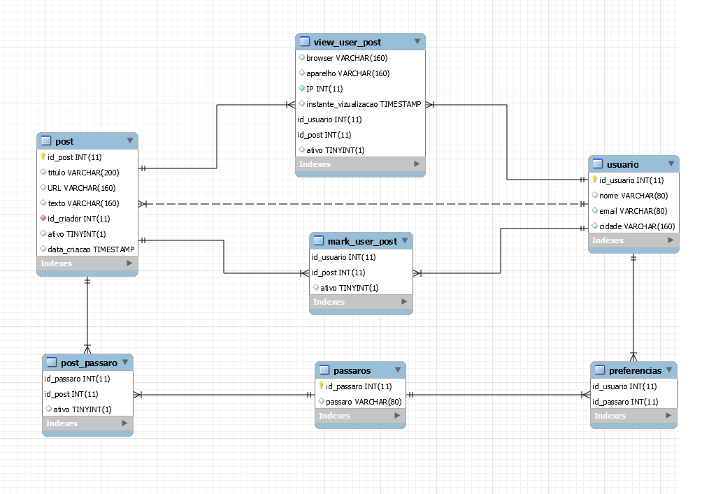

# Projeto1-Megadados

- Modelo Entidade-Relacionamento:

.png)

- Modelo Relacional:

    - Schema:

    - Dicionário de dados:
        - Tabela usuário: Representa os atributos de cada um dos usuários
        
            | Nome do campo  | Descrição | Auto-gerada | Chave primária | Chave estrangeira | Referencia | Restrições |
            | ------------- | ------------- | ------------- | ------------- | ------------- | ------------- | ------------- |
            | ID_USUARIO  | id do usuário  | sim, auto-incrementa | sim | não | - | não nulo |
            | NOME  | nome do usuário  | não | não | não | - | - |
            | EMAIL  | email do usuário  | não | não | não | - | - |
            | CIDADE  | cidade onde mora o usuário  | não | não | não | - | - |

            
        - Tabela pássaro: Representa os atributos de cada um dos pássaros
        
            | Nome do campo  | Descrição | Auto-gerada | Chave primária | Chave estrangeira | Referencia | Restrições |
            | ------------- | ------------- | ------------- | ------------- | ------------- | ------------- | ------------- |
            | ID_PASSARO  | id do pássaro  | sim, auto-incrementa | sim | não | - | não nulo |
            | PASSARO  | nome do pássaro  | não | não | não | - | - |
            
            
        - Tabela post: Representa os atributos de cada um dos posts
        
            | Nome do campo  | Descrição | Auto-gerada | Chave primária | Chave estrangeira | Referencia | Restrições |
            | ------------- | ------------- | ------------- | ------------- | ------------- | ------------- | ------------- |
            | ID_POST  | id do post  | sim, auto-incrementa | sim | não | - | não nulo |
            | TITULO  | título do post  | não | não | não | - | - |
            | URL  | URL de uma foto do post  | não | não | não | - | - |
            | TEXTO  | texto escrito no post  | não | não | não | - | - |
            | ID_CRIADOR  | id do criador do post  | não | não | sim | ID_USUARIO da tabela usuário | - |
            | ATIVO  | se o post está ativo ou não  | não | não | não | - | - |
            | DATA_CRIACAO  | quando foi criado o post  | sim, timestamp | não | não | - | - |

        - Tabela preferências: Representa quais pássaros cada usuário prefere
        
            | Nome do campo  | Descrição | Auto-gerada | Chave primária | Chave estrangeira | Referencia | Restrições |
            | ------------- | ------------- | ------------- | ------------- | ------------- | ------------- | ------------- |
            | ID_PASSARO  | id do pássaro  | não | não | sim | ID_PASSARO da tabela pássaro | - |
            | ID_USUARIO  | id do usuário  | não | não | sim | ID_USUARIO da tabela usuário | - |
            
        - Tabela mark_user_post: Representa quais pássaros cada usuário prefere
        
            | Nome do campo  | Descrição | Auto-gerada | Chave primária | Chave estrangeira | Referencia | Restrições |
            | ------------- | ------------- | ------------- | ------------- | ------------- | ------------- | ------------- |
            | ID_POST  | id do post  | não | não | sim | ID_POST da tabela post | - |
            | ID_USUARIO  | id do usuário  | não | não | sim | ID_USUARIO da tabela usuário | - |

